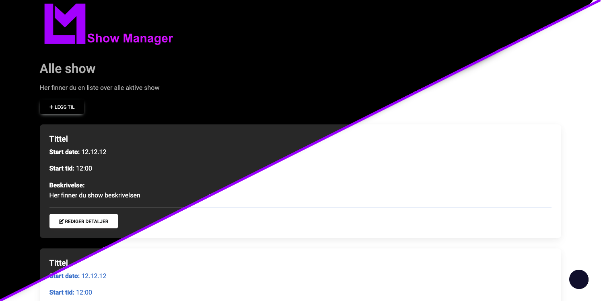

## Information
This is a web based system to make it easier to manage multiple festival shows. The point of this system is to manage fesitvals and shows and is not intended to be used for larger advanced festivals.

This system is for example perfect to use on an school talent show where you have multiple numbers and presenters in a show.

## Language support
The UI was primarly written in Norwegian but we are planing to redo some of the UI to add support for translations. Our goal is to have a fully translated Norwegian and English version.

[comment]: <> (WebLate link coming if high enough request)

## Dark mode support
The system is designed with both a light and dark theme. The system will by default use theme after what is primary in the OS.

## Responsive
The system is designed to be used on both desktops, laptops, tablets and phones.

## Main Contributors
Techognito - Backend coding
Jan Helge Naley - Frond end and initial concept

## LICENSE
Currently all rights are reseved except for open source code used in the project

See OSLICENSES.md for more information
